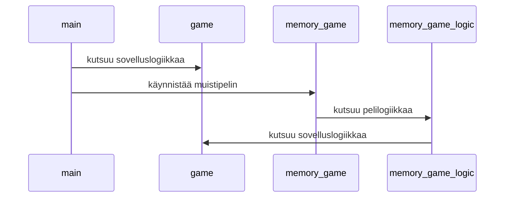

# SOVELLUKSEN ARKKITEHTUURI
- Sovelluksen arkkitehtuuri noudattaa seuraavaa rakennetta:

```mermaid
sequenceDiagram
    participant main
    participant game
    participant memory_game
    participant memory_game_logic

    main->>game: kutsuu sovelluslogiikkaa
    main->>memory_game: käynnistää muistipelin
    memory_game->>memory_game_logic: kutsuu pelilogiikkaa
    memory_game_logic->>game: kutsuu sovelluslogiikkaa
```
