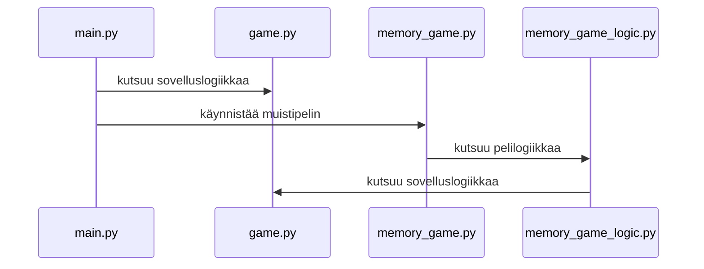
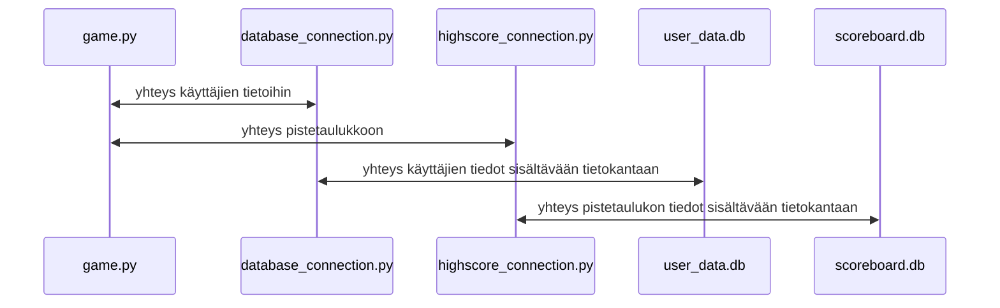

# SOVELLUKSEN ARKKITEHTUURI
- Sovelluksen arkkitehtuuri noudattaa käyttöliittymien ja logiikan osalta seuraavaa rakennetta:

- Sovelluksen arkkitehtuuri noudattaa tiedon tallentamisen ja haun osalta seuraavaa rakennetta:

