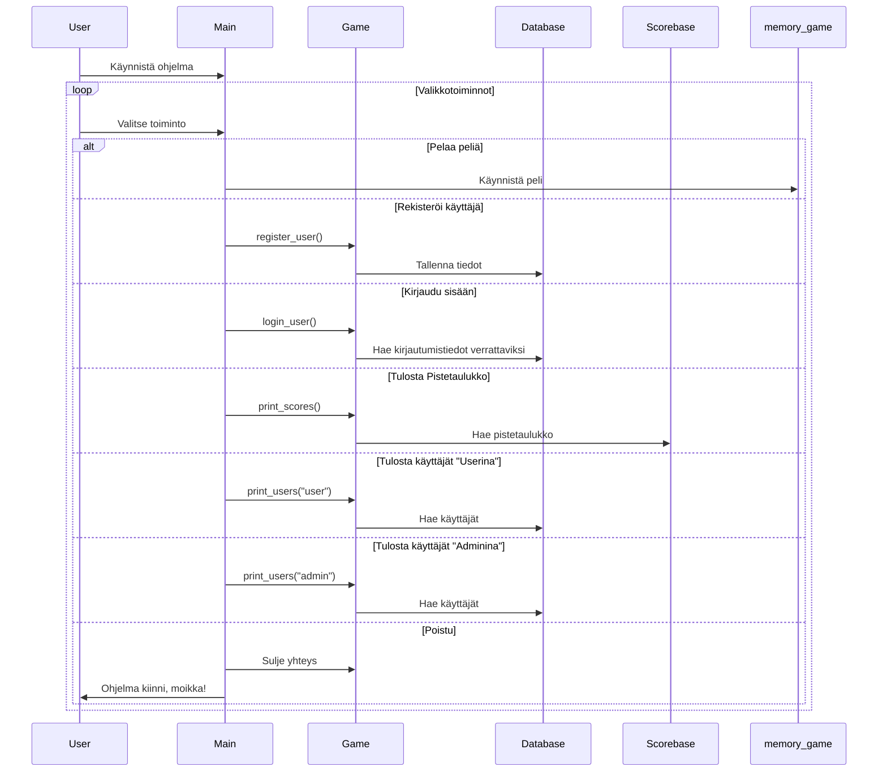

```mermaid
sequenceDiagram
    participant User
    participant Main
    participant Game
    participant Database
    participant Scorebase

    User->>Main: Käynnistä ohjelma
    loop Valikkotoiminnot
        User->>Main: Valitse toiminto
        alt Pelaa peliä
            Main->>memory_game: Käynnistä peli
        else Rekisteröi käyttäjä
            Main->>Game: register_user()
            Game->>Database: Tallenna tiedot
        else Kirjaudu sisään
            Main->>Game: login_user()
            Game->>Database: Hae kirjautumistiedot verrattaviksi
        else Tulosta Pistetaulukko
            Main->>Game: print_scores()
            Game->>Scorebase: Hae pistetaulukko
        else Tulosta käyttäjät "Userina"
            Main->>Game: print_users("user")
            Game->>Database: Hae käyttäjät
        else Tulosta käyttäjät "Adminina"
            Main->>Game: print_users("admin")
            Game->>Database: Hae käyttäjät
        else Poistu
            Main->>Game: Sulje yhteys
            Main->>User: Ohjelma kiinni, moikka!
        end
    end
```
