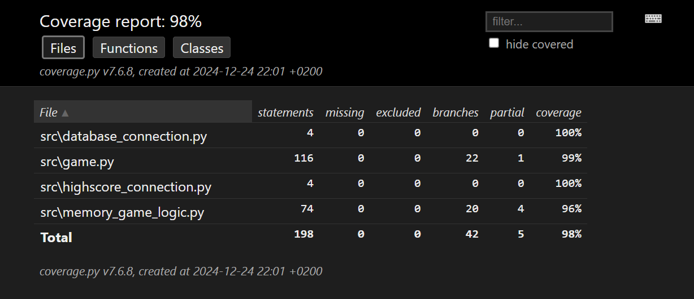

# TESTAUSDOKUMENTTI
Ohjelmaa tehtäessä ohjelman testaaminen koostui pääasiassa manuaalisesti tehdyistä järjestelmä- sekä yksikkötason testeistä. Kun ohjelman tila läheni valmista, testaaminen siirtyi vähitellen kohti unittestillä toteutettuja automatisoituja yksikkötestejä.

## AUTOMATISOIDUT YKSIKKÖTESTIT
- Ohjelma koostuu käytännössä neljästä pääosasta: tekstikäyttöliittymästä, graafisesta käyttöliittymästä, ohjelmalogiikasta ja pelilogiikasta. - Ohjelmassa on lisäksi tietokantayhteyksiin liittyvät omat tiedostonsa.
- Näistä edellä mainituista neljästä ohjelman pääosasta käyttöliittymät on jätetty testikattavuuden ulkopuolelle, joten testattavia osia ovat siten pääasiallisesti ohjelmalogiikka ("game.py") ja pelilogiikka ("memory_game_logic.py"), mutta välillisesti myös tietokantoihin liittyvät tiedostot ("user_data.db" ja "scoreboard.db") tulevat testatuiksi pääasiallisten testikohteiden ohessa.

## TESTiKATTAVUUS
- Sovelluksen testikattavuus on 98% eikä testikattavuusraportin perusteella yksikään kohta ole jäänyt kokonaan testaamatta. Testikattavuuden prosentteja laskee osittaiset puutteet testikattavuudessa.
- Mainittu testikattavuus muodostuu siis sovelluksen muista osista kuin tekstikäyttöliittymästä ("main.py") ja graafisesta käyttöliittymästä ("memory_game.py"), jotka ovat siis jätetty testauksen ulkopuolelle.

## MANUAALINEN JÄRJESTELMÄTESTAUS
- Manuaalista järjestelmätestausta suoritettiin kattavasti pitkin sovelluksen teon, mutta siitä ei luonnollisesti ole esittää sen kummempaa dokumentaatiota, koska manuaaliset testit on jo tähän mennessä poistettu tiedostoista.

## ASENNUS JA KONFIGUROINTI
- Sovellus on tehty ja testattu käytännössä kokonaisuudessaan windows-ypäristössä, lukuun ottamatta aivan viimeistä vaihetta, jossa sovelluksen toiminta testattiin 'cubbli linux' virtuaaliympäristössä ja viimeiset tarvittavat muutokset tehtiin sovellukseen.

## TOIMINNALLISUUDET
- Sovelluksen dokumentaatiossa määritellyt toiminnallisuudet on testattu toimiviksi eikä virheitä ole enää ilmaantunut toiminnallisuuksien käytön yhteydessä kokeiluista ja yrityksistä huolimatta.