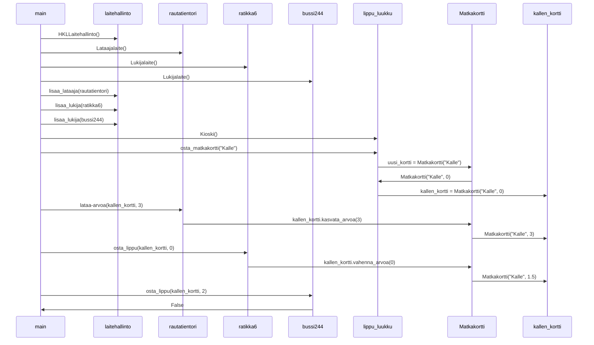

```mermaid
sequenceDiagram
    participant main
    participant laitehallinto
    participant rautatientori
    participant ratikka6
    participant bussi244
    participant lippu_luukku
    participant Matkakortti
    participant kallen_kortti

    main ->> laitehallinto: HKLLaitehallinto()
    main ->> rautatientori: Lataajalaite()
    main ->> ratikka6: Lukijalaite()
    main ->> bussi244: Lukijalaite()

    main ->> laitehallinto: lisaa_lataaja(rautatientori)
    main ->> laitehallinto: lisaa_lukija(ratikka6)
    main ->> laitehallinto: lisaa_lukija(bussi244)

    main ->> lippu_luukku: Kioski()
    main ->> lippu_luukku: osta_matkakortti("Kalle")
    lippu_luukku ->> Matkakortti: uusi_kortti = Matkakortti("Kalle")
    Matkakortti ->> lippu_luukku: Matkakortti("Kalle", 0)
    lippu_luukku ->> kallen_kortti: kallen_kortti = Matkakortti("Kalle", 0) 

    main ->> rautatientori: lataa-arvoa(kallen_kortti, 3)
    rautatientori ->> Matkakortti: kallen_kortti.kasvata_arvoa(3)
    Matkakortti ->> kallen_kortti: Matkakortti("Kalle", 3)
   

    main ->> ratikka6: osta_lippu(kallen_kortti, 0)
    ratikka6 ->> Matkakortti: kallen_kortti.vahenna_arvoa(0)
    Matkakortti ->> kallen_kortti: Matkakortti("Kalle", 1.5)

    main ->> bussi244: osta_lippu(kallen_kortti, 2)
    bussi244 ->> main: False
```
